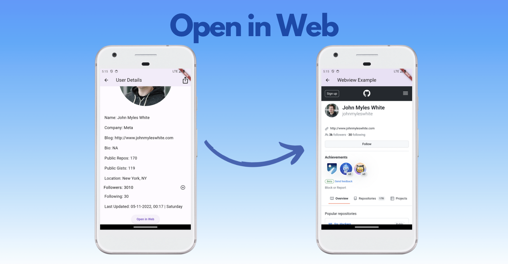

# ❝ Github Finder App ❞




## About
A flutter application which would let users help search and analyse Github users conveniently.

## Built With 🛠
- [http](https://pub.dev/packages/http) - A composable, Future-based library for making HTTP requests.
- [intl](https://pub.dev/packages/intl) - Provides internationalization and localization facilities, including message translation, plurals and genders, date/number formatting and parsing, and bidirectional text.
- [debounce_throttle](https://pub.dev/packages/debounce_throttle) - A debouncer and throttle that works with Future, Stream, and callbacks.
- [convert](https://pub.dev/packages/convert) - Contains encoders and decoders for converting between different data representations. It's the external counterpart of the dart:convert SDK library, and contains less-central APIs and APIs that need more flexible versioning.
- [webview_flutter](https://pub.dev/packages/webview_flutter) - A Flutter plugin that provides a WebView widget.
- [share_plus](https://pub.dev/packages/share_plus) - A Flutter plugin to share content from your Flutter app via the platform's share dialog.

For help getting started with Flutter development, view the
[online documentation](https://docs.flutter.dev/), which offers tutorials,
samples, guidance on mobile development, and a full API reference.

https://www.youtube.com/shorts/JzlRDThbMSk

```
MIT License

Copyright (c) 2021 Tanmay Patil.

Permission is hereby granted, free of charge, to any person obtaining a copy
of this software and associated documentation files (the "Software"), to deal
in the Software without restriction, including without limitation the rights
to use, copy, modify, merge, publish, distribute, sublicense, and/or sell
copies of the Software, and to permit persons to whom the Software is
furnished to do so, subject to the following conditions:

The above copyright notice and this permission notice shall be included in all
copies or substantial portions of the Software.

THE SOFTWARE IS PROVIDED "AS IS", WITHOUT WARRANTY OF ANY KIND, EXPRESS OR
IMPLIED, INCLUDING BUT NOT LIMITED TO THE WARRANTIES OF MERCHANTABILITY,
FITNESS FOR A PARTICULAR PURPOSE AND NONINFRINGEMENT. IN NO EVENT SHALL THE
AUTHORS OR COPYRIGHT HOLDERS BE LIABLE FOR ANY CLAIM, DAMAGES OR OTHER
LIABILITY, WHETHER IN AN ACTION OF CONTRACT, TORT OR OTHERWISE, ARISING FROM,
OUT OF OR IN CONNECTION WITH THE SOFTWARE OR THE USE OR OTHER DEALINGS IN THE
SOFTWARE.
```